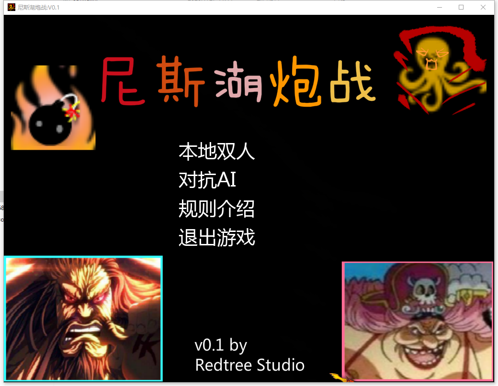
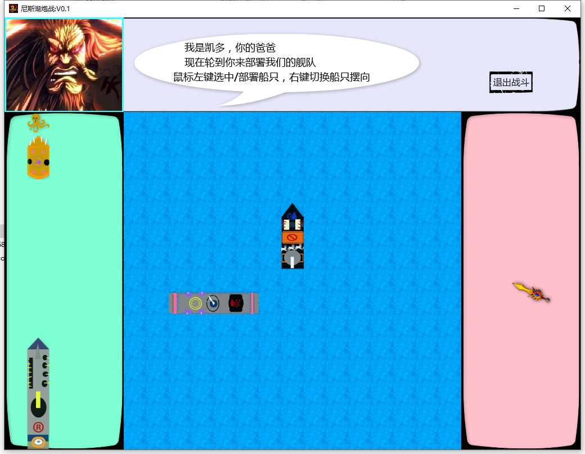
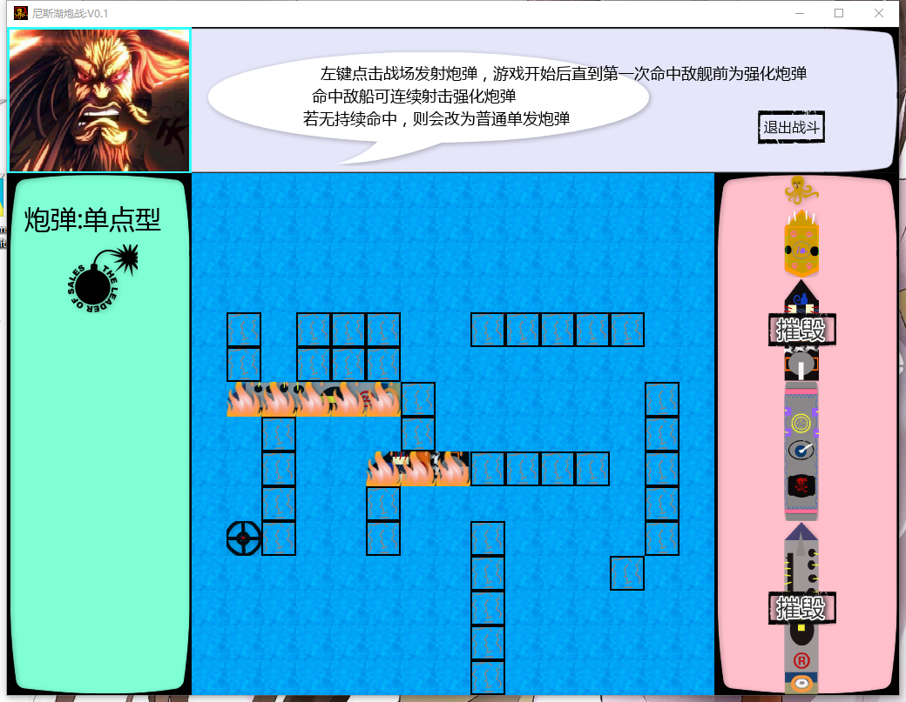

# GeLaoziFire
尼斯湖炮战-海贼王同人游戏，玩法类似海盗船炮战。

游戏使用pygame引擎制作，感兴趣的可以找我沟通要源码。

转发请注明出处。谢谢，禁止商业化盗用。

#游戏展示

#玩法介绍
支持本地双人和对战AI（还比较弱智）
游戏分为部署阶段和对战阶段
部署阶段可将己方的4条不同大小的船和小章鱼部署在格子中。
游戏开始后，双方轮流点击地图格子射击，直到第一次命中敌方单位前，都会获得强化炮弹。
第一次命中后，必须连续命中敌方单位才会获得强化炮弹。否则炮弹将变成单发炮弹。
当一方所有船只被击中后，另一方获胜。
小章鱼被攻击时，下回合会对敌方随机发射15枚炮弹。
